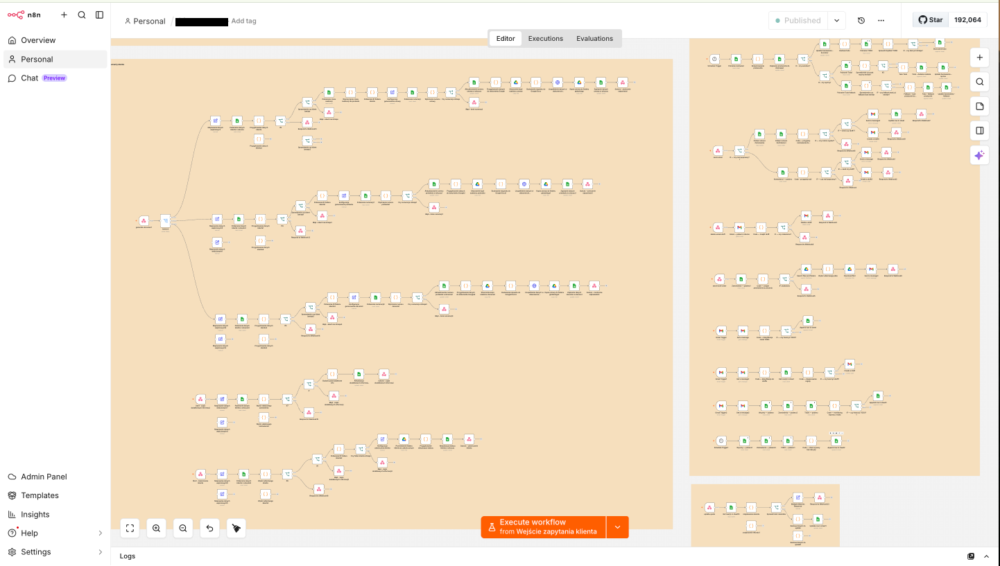
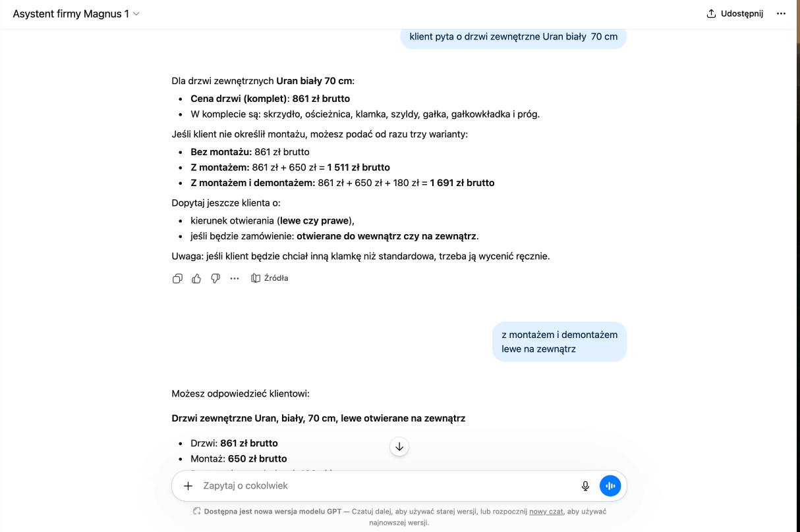
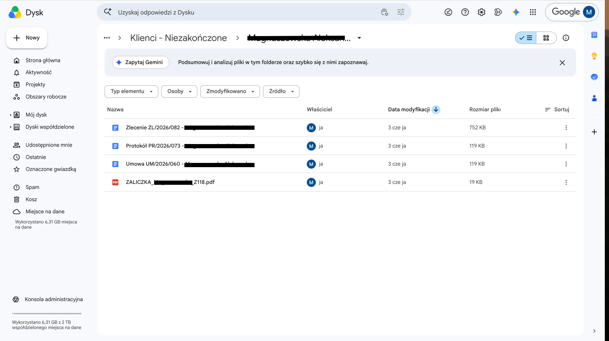
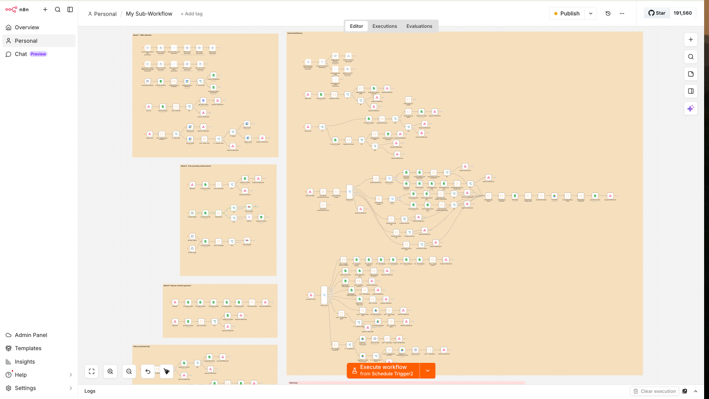
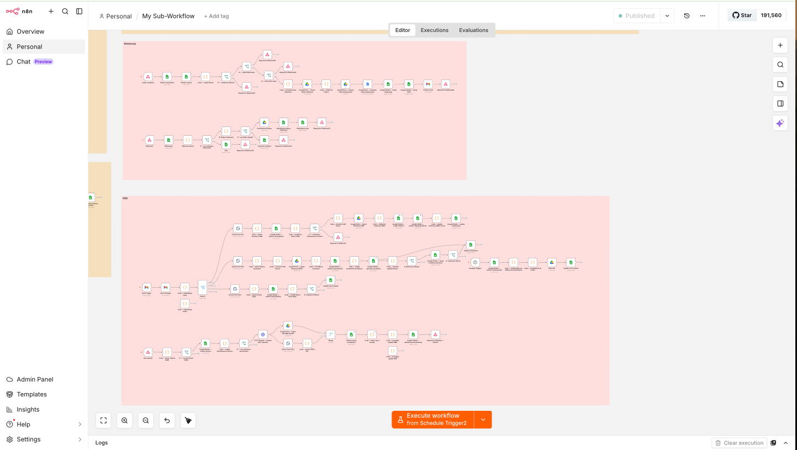
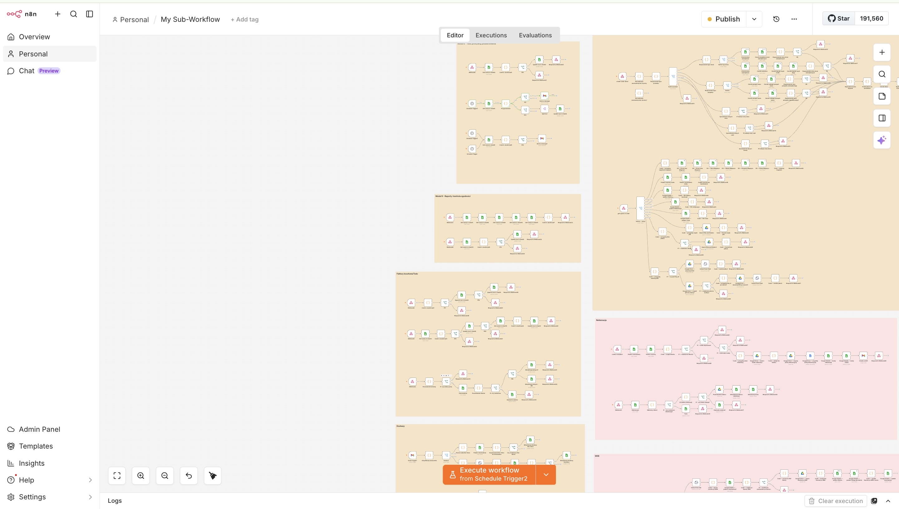
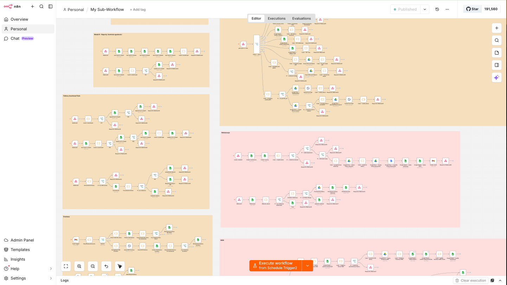
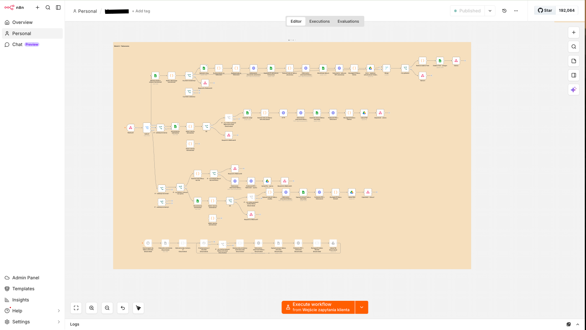

# AI Assistant for Business Process Automation

> A production-grade n8n automation system that replaces manual office work with an intelligent, multi-module AI assistant — from customer inquiries through quoting, ordering, invoicing, and document generation.

---

## Project Overview

This project is a comprehensive AI-powered automation platform built on **n8n** for a company in the window and door industry. It eliminates repetitive manual tasks across the full customer lifecycle — from the first inquiry to the final invoice.

The system operates as a collection of interconnected n8n sub-workflows, each responsible for a distinct business function. Together they form a seamless pipeline: an AI assistant handles customer questions in real time, while background automations manage quotes, orders, contracts, work orders, and invoices — all without manual intervention.

The entire state of the business (quotes, orders, client folders, numbering) is synchronized across **Google Sheets**, **Google Drive**, and **Fakturownia** (invoicing platform), with **Gmail** as the communication layer.

---

## System Features

### AI Chatbot Assistant
- Integrated with **ChatGPT** (via custom GPT) to answer customer questions about products and pricing in real time
- Supports complex queries: pricing with/without installation, product variants, configuration options
- Returns structured, copy-paste-ready responses for sales staff

---

### Quote Management
- Accepts quotes submitted via webhook (e.g. from a website form or chat)
- Validates and fuzzy-matches incoming quotes against the existing quote database (by phone, address, surname)
- Automatically records quotes into a dedicated **Google Sheets** spreadsheet
- Triggers follow-up tasks when no decision is made within a set timeframe

---

### Order Processing
- Converts approved quotes into full orders with one action
- Automatically calculates lead times and assembly dates
- Sends structured order data to the production team
- Creates client-specific **Google Drive** folders with auto-generated documents:
  - Contract (`Umowa`)
  - Installation Protocol (`Protokół`)
  - Work Order (`Zlecenie`)

---

### Invoice & Payment Automation
- Creates invoices in **Fakturownia** automatically (deposit invoice, final invoice, standard invoice)
- Fetches the generated PDF and delivers it via Gmail to the client
- Supports multiple invoice types: deposit, final, manual override
- Tracks `Fakturownia` order ID back to the Google Sheets record

---

### Email Monitoring & Classification
- Monitors Gmail inbox on a schedule
- Classifies incoming emails into categories: new quote, order confirmation, contractor communication, internal
- Routes each email to the correct sub-workflow for processing
- Extracts structured data (client name, phone, address) from email body using AI

---

### Task & Todo Management
- Automatically creates todo tasks in a **Google Sheets** task board when manual action is required
- Generates tasks for: unmatched quotes, assembly scheduling, payment follow-up, and production review
- Each task includes client name, phone, address, and deadline

---

### Google Sheets Data Layer
- All business data is stored in structured Google Sheets:

| Sheet | Purpose |
|---|---|
| `Wyceny` | Quote pipeline |
| `Zamówienia` | Order records |
| `Kontrahenci` | Client database |
| `Cennik Ekipa` | Installation team pricelist |
| `Cennik Parapety` | Window sill pricelists |
| `Czas realizacji` | Lead time configuration |
| `Numeracja` | Auto-numbering for contracts/invoices |
| `Todo` | Manual task board |

---

## Tech Stack

| Component | Technology |
|---|---|
| Workflow engine | [n8n](https://n8n.io) (self-hosted) |
| AI / LLM | OpenAI ChatGPT (custom GPT) |
| Scripting | JavaScript (n8n Code nodes) |
| Data storage | Google Sheets (via OAuth2) |
| File storage | Google Drive (via OAuth2) |
| Email | Gmail (via OAuth2, trigger + send) |
| Invoicing | [Fakturownia](https://fakturownia.pl) REST API |
| Document generation | Google Docs API (`batchUpdate`) |
| Triggers | Webhooks, Gmail triggers, Schedule triggers |

---

## Project Scale

| Metric | Value |
|---|---|
| Total nodes | **280** |
| Sub-workflows | **5** |
| Code (JS) nodes | 63 |
| Google Sheets nodes | 63 |
| Conditional (IF) nodes | 35 |
| Webhook / respond nodes | 48 |
| Gmail nodes | 14 |
| HTTP Request nodes | 14 |
| Google Drive nodes | 15 |

---

## Workflow Architecture

The system is organized into a main workflow and five specialized sub-workflows:

---

## Deployment & JSON Import Guide

### Prerequisites

- A running **n8n** instance (self-hosted or n8n Cloud)
- Google account with OAuth2 credentials configured in n8n for:
  - Google Sheets
  - Google Drive
  - Gmail
- A **Fakturownia** account with API access
- A **Custom GPT** (ChatGPT) configured as the AI assistant

### Google Sheets Setup

Create the following spreadsheets in your Google Drive and note their IDs:

| Placeholder in JSON | Sheet Purpose |
|---|---|
| `YOUR_SPREADSHEET_ID_QUOTES` | Quote pipeline (`Wyceny`) |
| `YOUR_SPREADSHEET_ID_ORDERS` | Order records (`Zamówienia`) |
| `YOUR_SPREADSHEET_ID_CLIENTS` | Client database (`Kontrahenci`) |
| `YOUR_SPREADSHEET_ID_TODO` | Task board (`Todo`) |
| `YOUR_SPREADSHEET_ID_NUMBERING` | Contract/invoice numbering |
| `YOUR_SPREADSHEET_ID_LEAD_TIME` | Lead time config |
| `YOUR_SPREADSHEET_ID_PRICELIST_TEAM` | Installation team pricelist |
| `YOUR_SPREADSHEET_ID_PRICELIST_EXT_SILLS` | External window sill pricelist |
| `YOUR_SPREADSHEET_ID_PRICELIST_INT_SILLS` | Internal PVC sill pricelist |

### Google Drive Setup

Create the following folders and note their IDs:

| Placeholder in JSON | Folder Purpose |
|---|---|
| `YOUR_DRIVE_FOLDER_CLIENTS_ACTIVE` | Active client folders |
| `YOUR_DRIVE_FOLDER_INVOICES` | Manual invoice uploads |
| `YOUR_DRIVE_FOLDER_CONTRACTS_GLOBAL` | Signed contracts archive |
| `YOUR_DRIVE_FOLDER_PROTOCOLS_GLOBAL` | Signed protocols archive |
| `YOUR_DRIVE_TEMPLATE_CONTRACT` | Contract template file ID |
| `YOUR_DRIVE_TEMPLATE_PROTOCOL` | Protocol template file ID |
| `YOUR_DRIVE_TEMPLATE_WORK_ORDER` | Work order template file ID |

